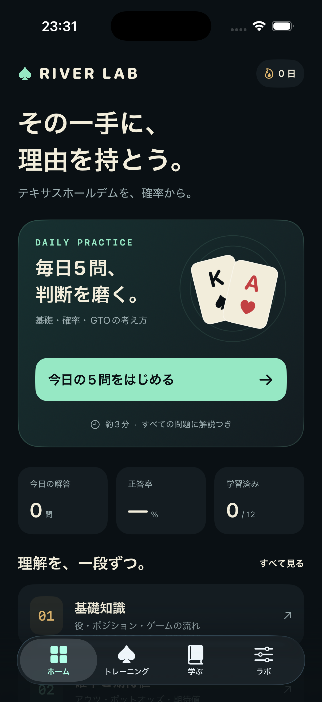

# River Lab

テキサスホールデムを、確率と判断の根拠から学ぶ日本語のiPhoneアプリ。SwiftUI製、iOS 17以降に対応します。

## 初版の機能

- **ホーム**：毎日の5問、今日の解答数、正答率、学習済みレッスン数、連続学習日数。
- **トレーニング**：基礎・確率・GTOの3テーマ、全30問。各問題に理由と必要に応じた数式・カード表示。誤答を復習し、正解したら復習リストから除外。
- **学ぶ**：全12レッスン。ゲームの流れ、役、キッカー、位置、レンジ、アウツ、ポットオッズ、EV、分散、均衡、混合戦略、リバーの簡略ゲーム、MDF。
- **ラボ**：ポットオッズとコールEV、アウツからの完成率、指定した2人のハンドのエクイティ、ベットサイズとGTO簡略モデルの関係を操作して確認。
- **学習記録**：端末内に保存し、次回起動時に復元。テーマ別の理解度も表示。

教材・計算・記録はオフラインで動作します。レッスン末尾の参考資料は外部ブラウザで開くため、通信が必要です。アカウント登録、広告、外部データ送信は実装していません。

## GTO学習の範囲

この版はGTOの原理と、明示した仮定の下で解析的に解けるリバーゲームを学ぶアプリです。実際のノーリミットホールデム全局面のソルバー、ソルバー由来のプリフロップレンジ、未計算のハンドの推奨頻度は含みません。

正答率は教材の理解度を表し、実戦の勝率やGTO戦略との一致度ではありません。実際のソルバー練習を拡張する場合は、人数、スタック、レーキ、レンジ、アクションツリーを固定し、利用権を確認した計算済みデータを取り込む設計が必要です。

## 起動

1. `RiverLab.xcodeproj` をXcodeで開きます。
2. Schemeに `RiverLab`、実行先にiPhoneシミュレーターを選びます。
3. Run（⌘R）で起動します。

実機では `Signing & Capabilities` のTeamに自分のApple開発用アカウントを設定し、接続したiPhoneを選んでRunしてください。プロジェクトには開発チームを固定していません。2026-09-12に既存の開発用署名をビルド時に指定し、接続中のiPhone 17（iOS 26.6）へのビルド・インストール・起動を確認しました。TestFlight・App Storeへの配布は未実施です。

依存パッケージはありません。Xcode 26.3 / iPhone 17 Pro（iOS 26.3）で開発・検証しています。

```sh
swift test
./Scripts/build.sh
./Scripts/test.sh
```

`Scripts/test.sh` はコアテストとシミュレーターのUIテストを実行し、ログとxcresultを `Artifacts/` に保存します。別の端末は `RIVERLAB_DESTINATION` 環境変数で指定できます。

## 計算の前提

Pは**相手のベット前**のポット、Bは相手のベット額と自分のコール額、Eはエクイティです。コールの式はヘッズアップ・レーキなし・追加ベットなしで、現在のフォールドEVを0とします。

| 指標 | 式 |
| --- | --- |
| 必要エクイティ | B / (P + 2B) |
| コールEV | E × (P + 2B) − B |
| 固定アウツの完成率 | 1 − 各ドローで対象カードを外す確率の積 |
| 簡略モデルのMDF | P / (P + B) |
| 極端に二分されたリバーベット範囲のブラフ比率 | B / (P + 2B) |

ドローの完成率とショーダウンでのエクイティは異なります。エクイティ計算では勝率に引き分け率の半分を加えます。ターンは残り44枚、リバーは確定した1通りを全列挙。それ以前は固定乱数による2,500回のモンテカルロ推定を使います。相手の2枚を指定する方式で、レンジ全体への計算は未実装です。

役判定は5〜7枚から最強の5枚を比較し、A2345、ボードだけの役、キッカー、引き分けに対応します。重複カード、不正なランク、ストリートに合わない枚数を拒否します。

## 構成

- `App/`：SwiftUI画面、端末内ストア、アイコン。
- `Core/`：教材、確率式、役判定、エクイティ計算、学習記録モデル。
- `Tests/`：計算、役判定、記録、教材データの検証。
- `UITests/`：5問の完走、学習済み状態の保存・復元、計算とカード選択の操作検証。
- `Docs/Sources.md`：教材の参照元。

UIテストは専用UserDefaultsスイートを使用します。`--uitesting` でテスト記録を初期化し、`--uitesting-preserve` で同じテスト記録を復元します。通常利用の記録には触れません。


